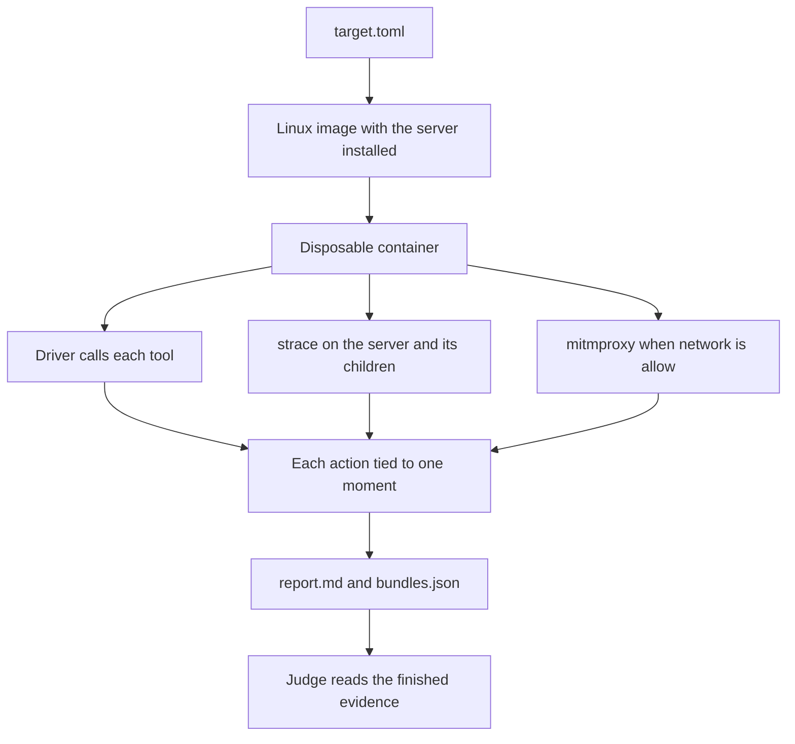

# mcpdet

mcpdet runs one local MCP server inside a disposable Linux container, calls its tools, and records what the server did. For each tool call, the report asks one question. Did this call do what the tool description says?

## Quick start

You need Node 24, Docker, and openssl. On a Mac, use Docker Desktop. On Linux, use Docker Engine. mcpdet installs its own copy of the server inside the container. It does not run a copy already installed on your machine.

Run the commands from the repository root. An `allow` run reads `proxy/mcpdet_addon.py` from the current directory.

```sh
npm install
npx mcpdet detonate targets/mcp-server-git.toml
```

The command prints a run directory such as `runs/mcp-server-git-a1b2c3d4`. Open `report.md` in that directory.

### Read the report

The first heading is Verdict. The line under it is the result.

- `Matches` means every call that ran did what its description claims.
- `Does not match` means at least one call did something the description does not cover. The report does not call the server malicious.
- `Unclear` means the judge could not decide. A bad API key lands here too, and the run still writes `judgments.json`.
- `Judge not run` means there was no API key, or you passed `--no-judge` to `detonate`.
- `No tool calls.` means the server never finished a call.

A table under that line has one row per call. The columns are Call, Tool, Verdict, and What happened. The Verdict column uses those same words in lowercase. It can also say `invalid` or `no judgment`.

If a call does not answer within 30 seconds, the run stops. Tools that never ran are absent, and the headline counts only the calls that happened.

`bundles.json` is the event list behind those rows. `judgments.json` is the judge's own text, and it appears only when the judge ran. The report already summarizes `findings.json`.

Rebuild `report.md` from a finished run without starting the server again.

```sh
npx mcpdet report <run-directory>
```

### Point mcpdet at your server

A target file is TOML. The `path` field is relative to that file. `base_image` has to be a Debian image, because the build runs `apt-get` and `useradd`. `network` defaults to `allow`. Set it to `block` unless you want outbound HTTP and HTTPS. With `allow`, that traffic leaves only through a proxy, and the remote host sees your public address. You can also set `setup` commands and `env` entries. `targets/mcp-server-git.toml` uses `setup`.

```toml
name = "my-server"
base_image = "node:24-bookworm-slim"
install = ["npm install"]
source_path = "/opt/server"
command = ["node", "/opt/server/dist/index.js"]
network = "block"

[source]
kind = "local"
ecosystem = "npm"
path = "../my-server"

[[scenario]]
tool = "echo"

[scenario.arguments]
text = "hello"
```

Each `[[scenario]]` entry is one tool call, with the arguments you choose. mcpdet then calls every other advertised tool once, and fills required fields with placeholders, until a call goes unanswered. A package from a registry uses `kind = "registry"`, plus `package` and an exact `version`. `targets/mcp-server-git.toml` is that shape. `ecosystem` is `npm` or `pypi`.

### Set the API key

The judge calls `claude-sonnet-5`. Create a file named `.env` in the directory you run mcpdet from. Git already ignores that file.

```
ANTHROPIC_API_KEY=your-key
```

mcpdet loads `.env` when the file is there. Without a key, the run still finishes, and the verdict says `Judge not run`. On `detonate`, pass `--no-judge` to skip the judge even when the key is set. `report` does not take that flag. With a key, the run sends tool descriptions, source snippets, and each event's parsed body to Anthropic.

Ask the judge again without repeating the detonation. If the key is missing, `--rejudge` leaves the existing `judgments.json` in place.

```sh
npx mcpdet report <run-directory> --rejudge
```

## How it works



### Steps

1. mcpdet reads the target file and builds a Linux image. Commands in `install` and `setup` run during that build, and they are not part of the trace.
2. It plants decoy credentials, then starts the server as the user `detonee`.
3. `strace` records that server and every child. The trace covers processes, files, and network attempts.
4. When `network` is `allow`, HTTP and HTTPS leave only through a mitmproxy container that logs each request and response. Other protocols have no route out. When `network` is `block`, the container has no network. The first run stores a proxy CA at `~/.mcpdet/ca/mitmproxy-ca.pem` and reuses it. That file includes a private key and is readable by every user on the machine.
5. A driver in the container acts as the MCP client. It sends `initialize`, lists the tools, calls each scenario entry, then calls any tool the scenario did not name. If a call does not answer, the driver stops.
6. mcpdet copies the trace and the message transcript out, removes the container, and places every event into startup, one tool call, shutdown, or unmatched.
7. Fixed rules name the side effects. If `ANTHROPIC_API_KEY` is set, the judge says whether each call matches its description. The judge cites events. It does not change them.
8. mcpdet writes `report.md`.

### Features

- The container and its image are removed when the run ends. The report stays in `runs/`.
- Each action is tied to startup, one tool call, shutdown, or a gap where no call was in flight. A process that keeps running after the reply stays with the call that started it.
- Decoy secrets are new on every run. A secret counts when its value later shows up in a file, a DNS name, or a request.
- Six rules name a spawned process, a modified file, credential access, a network attempt, code loaded late, and an exposed decoy secret.
- The verdict checks each description against what that call did.

## Things to improve

None of this is built yet.

- An analyst dashboard opens a saved run and shows the verdict beside the events.
- The container and the tracer run in the cloud, so the laptop does not need Docker.
- A process on the computer listens on a socket. When `npm` installs a package, that process asks an external service whether to detonate it. If the verdict is `Does not match`, the install stops.
- The report and the judge result go to S3, grouped by package and version, so a later check can reuse them. The dashboard reads that store. A Postgres table holds the fields you look up, and one column is the S3 key.

## Where the rest lives

`docs/technical-design.md` is the full design. `targets/` has example target files, including a local server at `targets/detfix.toml`.
